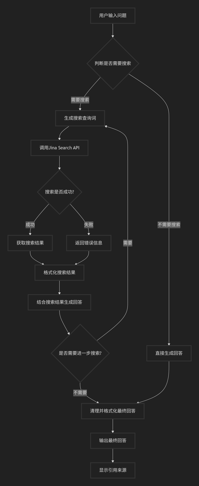

# Search Agent

本仓库实现了一个基于本地 Qwen3-0.6B 模型的智能搜索代理（Search Agent），能够在必要时调用 Jina.ai 搜索接口获取实时信息并整合为带来源的答案。仓库包含两条互相独立的实现思路：

- `search_agent.ipynb`：推荐的「标签检测」模式（详细、易复现、便于汇报）。
- `tst2.py`：实验性的「流式生成 + KV cache」模式（更接近实时流式交互，需要额外 API）。

本 README 重点说明两部分的目的、运行方法与关键函数，便于汇报与演示。

**目录结构（简要）**
- `search_agent.ipynb` — 标签检测模式（含完整代码与说明）
- `tst2.py` — 流式生成模式（实验性脚本）
- `jina.py` — 简单的 Jina API 测试脚本
- `sample.py` — 模型加载与推理测试脚本
- `Qwen3-0.6B/` — 本地模型文件夹

---

**总体说明（高层）**

1. 设计目标：当用户问题需要最新/具体事实（如股价、天气、新闻等）时，自动触发外部搜索；否则直接使用本地模型回答。答案应包含引用来源并在内部与外部信息之间做清晰分离。
2. 两种实现的侧重点：
   - 标签检测（`search_agent.ipynb`）：模型输出包含 `<search>查询词</search>` 标签触发搜索，基于多轮 prompt 迭代生成最终答案。实现思路清晰、便于复现与演示。
   - 流式生成（`tst2.py`）：逐 token 生成并在检测到工具触发时暂停、调用搜索，然后继续生成（复用 KV cache）。延迟低但代码复杂且需要额外 API（例如 Qwen3-max）。

---

**快速开始（建议演示流程）**

1. 安装依赖：

```powershell
pip install transformers torch requests accelerate
```

（若使用 `tst2.py` 的 4-bit 量化/流式功能，还需：）

```powershell
pip install bitsandbytes openai python-dotenv
```

2. 准备模型：确认 `Qwen3-0.6B` 文件夹在 `C:/Users/nashk/Documents/nashknight/search_agent/Qwen3-0.6B`。

3. 运行（建议先在 Notebook 中按单元顺序执行 `search_agent.ipynb`）：

```powershell
# 启动 jupyter notebook 或 lab
jupyter notebook search_agent.ipynb
```

或者运行 `tst2.py`（实验脚本）：

```powershell
python tst2.py
```

注意：访问外网需设置代理（默认示例 `127.0.0.1:7890`）并配置 `JINA_API_KEY`、`JINA_API` 等环境变量或在脚本中设置常量。

---

**详细说明 — `search_agent.ipynb`**

本节分为三部分：整体工作流、每个重要函数的职责与实现要点、运行示例与注意事项。

1) 工作流概述

- 用户输入原始问题（`user_query`）。
- 使用 `BASE_PROMPT` 指导模型判断是否需要检索：若需要，模型应输出格式化标签 `<search>关键词</search>`。
- 系统检测到 `<search>` 标签后：调用 `fetch_search_result()` 拉取搜索结果并格式化为 `formatted_sources`；将该信息注入下一轮 prompt 并继续生成。
- 重复上述步骤直到模型不再输出 `<search>`；将模型生成的可见内容（移除内部标签后的）作为最终答案，并列出引用来源。

<div style="text-align:center">
  

  <p style="font-style:italic; margin-top:8px;">图：Search Agent 标签检测工作流（用户输入 → 模型判断是否搜索 → 调用 Jina → 整合信息 → 迭代/输出最终答案）</p>
</div>

2) 关键函数（按 notebook 实现顺序）

- `load()`
  - 目的：加载分词器与模型（`AutoTokenizer`, `AutoModelForCausalLM`）。
  - 关键点：使用 `local_files_only=True` 以保证从本地 `Qwen3-0.6B` 加载；如果有 GPU，脚本会自动使用 `device_map='auto'`。

- `generate(prompt, max_new_tokens=512)`
  - 目的：将 prompt 输入模型并产生后续 token，返回生成的 token ids、原始解码（含特殊 token）以及干净文本（跳过特殊 token）。
  - 实现要点：
    - 对话模板兼容：若 tokenizer 支持 `apply_chat_template`，会使用该方法构建模型输入；否则直接用 prompt。
    - 将输入张量移动到模型所在设备，并传入 `model.generate()`。
    - 仅取 `input_ids` 之后的新生成部分进行解码与返回，防止重复包含 prompt 内容。

- `clear_model_cache()`
  - 目的：清理模型 KV cache 与 GPU 缓存，保证每个查询独立（避免测试间干扰）。
  - 实现要点：检查并移除 `past_key_values`，在有 GPU 时调用 `torch.cuda.empty_cache()`。

- `fetch_search_result(query: str, use_proxy: bool = True, max_sources: int = MAX_SOURCES_PER_SEARCH) -> dict`
  - 目的：调用 Jina Search API（`https://s.jina.ai`）获取结构化搜索结果。
  - 返回：标准字典，形如 `{ 'sources': { '信息1': {'url':..., 'description':..., 'title':...}, ...}, 'error': None }`；出错时返回 `{ 'error': '错误信息', 'sources': {} }`。
  - 实现要点：
    - 使用 `requests.get()`，支持可选代理 `PROXIES`。
    - 解析 `data` 字段，截取前 `max_sources` 条并裁剪 `description` 长度以防上下文爆炸。
    - 处理网络/解析异常并以 `error` 字段返回错误信息。

- `extract_search_query(raw: str)`
  - 目的：从模型原始输出中提取 `<search>...</search>` 标签内容。
  - 实现要点：使用正则 `re.search(r'<search>\s*([^<\n]+?)\s*</search>')`，只接受长度合理（<=80）的查询词，返回 `(query, raw_trunc)`，其中 `raw_trunc` 是截断到标签结束位置的原始输出，便于展示。

- `clean_final_response(text: str) -> str`
  - 目的：将模型的最终输出清洗为用户可见的文本，移除内部标签 `<think>`、`<search>` 及其内容。
  - 实现要点：使用 `re.sub()` 删除这些标签与其包裹内容，并去除空行与多余空白，返回整洁文本。

- `format_sources_for_prompt(sources_dict: dict, used_sources: dict) -> str`
  - 目的：把 `fetch_search_result()` 返回的 sources 格式化为可以拼接回 prompt 的文本片段，并在 `used_sources` 中登记已使用的 URL（用于最终引用列表）。
  - 实现要点：对每条 source 截断 `description` 字段，生成易读的多行字符串并更新 `used_sources`。

- `run_search_agent(user_query, max_rounds=5, max_new_tokens=512, use_proxy=True)`
  - 目的：多轮驱动的核心函数，协调生成、检测 `<search>`、调用搜索并迭代直到得到最终答案或出错。
  - 核心逻辑：
    1. 清理模型缓存以确保独立运行。
    2. 初始化 `prompt`（将 `BASE_PROMPT` 与 `user_query` 拼接）。
    3. 循环最多 `max_rounds` 轮：每轮调用 `generate()` 产出 `raw`。
    4. 用 `extract_search_query()` 检测是否需要搜索；若需要，调用 `fetch_search_result()`，格式化结果并把信息注入新的 `prompt`，进入下一轮；若不需要搜索，则用 `clean_final_response()` 清理并返回最终结果。
    5. 在每轮中维护 `used_sources`（全局追踪），并把每轮信息以结构化字典追加到 `rounds` 列表，便于展示与调试。

- `show_rounds(rounds, used_sources=None, user_query=None)`
  - 目的：以可读的文本格式展示多轮执行细节（用于汇报与排查），包括每轮 raw 输出、搜索关键词、搜索到的部分信息与最终答案及引用列表。

3) 运行示例（汇报用）

- 不需要搜索的问法：`今天我心情真好` → 直接返回模型生成的答案。
- 需要搜索的问法：`查询特斯拉的实时股价` → 期望模型先输出 `<search>特斯拉实时股价</search>`，系统调用 Jina，整合后返回最终答案并列来源。

4) 注意事项与汇报要点

- 展示时强调「标签检测」方案的优势：实现简单、每轮 prompt 可见、便于调试与复现。
- 演示时务必展示 `rounds` 的内容与 `used_sources`，说明如何通过多轮查询逐步充实信息并最终回答。
- 网络请求与代理：在无代理或 API Key 错误时，`fetch_search_result()` 会返回 `error`，应在演示中说明如何配置 `JINA_API_KEY` 与 `PROXIES`。

---

**详细说明 — `tst2.py`（实验性流式生成）**

本节为 `tst2.py` 提供面向技术评审的详细说明，便于演示流式中断-搜索-继续生成的设计与调试要点。

1) 脚本定位与目标

- `tst2.py` 是一个实验性脚本，用以验证如何在低显存量化模型上实现 token-by-token 流式生成，并在检测到工具调用信号（例如 `<search>`）时中断生成、调用检索工具并将检索信息注入后续生成中，整个过程复用模型的 KV cache（`past_key_values`）以节省计算。

2) 依赖与运行环境

- Python 包：`transformers`, `torch`, `bitsandbytes`, `openai`, `requests`, `python-dotenv`。
- 环境变量：
  - `JINA_API`：Jina 查询 API token（脚本内使用 `os.getenv('JINA_API')`）。
  - `DASHSCOPE_API_KEY`：用于调用 Aliyun Dashscope / `qwen3-max`（脚本示例中用作二级过滤）。
- 模型路径：脚本示例使用本地量化模型路径 `model_name`（示例为 Windows 路径）。

3) 关键组件与函数讲解

- `bnb_config = BitsAndBytesConfig(...)`
  - 作用：配置 4-bit 量化参数，减少显存占用使模型可在较小 GPU 上运行。

- `tokenizer = AutoTokenizer.from_pretrained(model_name)` / `model = AutoModelForCausalLM.from_pretrained(...)`
  - 加载量化后的模型与 tokenizer，注意 `from_pretrained` 的参数需要与模型文件格式一致（量化元信息、vocab 等）。

- `filter(query, content)`
  - 作用：将检索到的原始文本用二级大模型（示例使用 Aliyun Dashscope 的 `qwen3-max`）进行摘要与提取关键信息，返回包裹在 `<response>...</response>` 的摘要字符串。
  - 实践要点：尽量限制 `content` 长度并设置合理的 prompt，引导二级模型只返回精炼结果，避免多余的解释。

- `generation(query, info, round, model=model, tokenizer=tokenizer)`
  - 作用：脚本的生成主循环，按步（每次一个 token）调用 `model(...)` 得到 logits 与 `past_key_values`，使用 `past_key_values` 复用 KV cache 来继续后续生成。
  - 详细逻辑：
    1. 构造 `sys_prompt`，指明何时输出 `<tool_response><search>`（严格固定字符串），避免模型以其它方式调用工具。
    2. 使用 `tokenizer.apply_chat_template(...)` 构造 prompt（脚本中以该方法生成推理输入）。
    3. 将 prompt 编码为张量 `inputs`，并设置 `generated = inputs['input_ids']`。
    4. 在循环内：
       - 调用 `outputs = model(input_ids=generated, past_key_values=past_key_values, use_cache=True)`。
       - 从 `outputs.logits[:, -1, :]` 取出下一 token 的分布；示例中用 `torch.argmax` 作为解码策略（可替换为 `top-k`/`top-p` 采样或温度采样以避免死循环或过度确定输出）。
       - 更新 `past_key_values = outputs.past_key_values`，并把新生成的 `next_token` 传入下一轮循环（作为 `generated`）。
       - 实时解码并打印 `decoded = tokenizer.decode(next_token[0])`，将输出片段附加到 `full_text`。
    5. 中断检测：
       - 若 `tmp`（尾部缓冲区）中包含 `<search>`，脚本会调用 `search(query)` 并把返回的 `info` 拼接回 `query`，随后递归或循环进入下一轮生成（保留并复用 `past_key_values`）。
       - 若包含结束标记 `<|im_end|>`，则终止生成并返回。

- `search(query: str)`
  - 作用：调用 Jina (`https://s.jina.ai/?q=...`) 获取检索结果，解析 JSON 中的 `data` 列表并构造 `content` 字符串传给 `filter()` 做二级处理，返回精炼后的 `filtered_content`。
  - 实践要点：
    - 对网络请求做超时与错误处理，避免阻塞主生成循环过久。
    - 建议在生产中把 `search()` 改为异步实现或在单独线程中执行，以降低生成延迟并避免阻塞主线程。

4) 运行示例

```powershell
# 运行脚本（需在 .env 配置 API Key）
python tst2.py
```

脚本主入口示例中会以 `query = "查询特斯拉的实时股价"` 启动 `generation(query, info="", round=1)`。

5) 调试与性能建议

- 解码策略：当前使用 `torch.argmax` 非常确定性，容易导致输出重复或卡在固定 token。建议改为 `top-k/top-p` 采样或加入温度参数。示例改法：

```python
probs = torch.softmax(logits / temperature, dim=-1)
next_token = torch.multinomial(probs, num_samples=1)
```

- KV cache 大小：`past_key_values` 会随生成长度增长，如果你多轮复用 KV cache，请注意显存增长并在合适时机清理或裁剪缓存。
- 异步 search：把 `search()` 放到后台线程或使用 `asyncio` 可避免等待网络返回阻塞生成。主生成循环检测到触发标记后可以切换到等待状态并在后台填充 `info`。
- 日志与采样：增加对 `decoded` 的短缓冲打印与日志记录，便于定位模型何时输出 `<search>`、`<|im_end|>` 等特殊标记。

6) 安全性与鲁棒性建议

- 外部请求失败：`search()` 应返回清晰的错误标识（例如 `None` 或 `{"error":"..."}`），主逻辑需处理此类错误并决定是否重试或跳过。
- 长文本截断：对传给二级模型的 `content` 做摘要或截断，避免超长输入导致二级模型返回错误。

7) 适用场景与限制

- 适用场景：对实时外部信息有强需求且希望实现流式用户体验（例如聊天机器人需要边生成边检索）。
- 限制：实现复杂度高、易受解码策略和 KV cache 管理影响；对于需要严格可解释的多轮流程，推荐使用 `search_agent.ipynb` 的标签检测方式。

---

如果你满意这份更详细的 `tst2.py` 说明，我会把此 TODO 标记为已完成并进行一次轻微语法校对（我不会改动 `search_agent.ipynb` 部分）。

---

如果你需要，我可以：
- 将 `search_agent.ipynb` 中的函数注释部分提取为一个单独的 `.py` 文件以便代码审阅；
- 为 `README.md` 再生成一个更简短的 PPT 演示要点（每页 3-5 bullet）以便汇报。 

---

作者与联系方式：Nash-Knight

许可证：MIT
